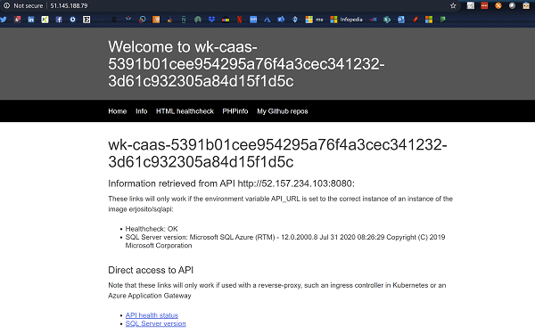

# Challenge : Containers

**[Home](../README.md)** - [Next Challenge >](./02-aks_private.md)

## Introduction

This challenge will cover the basics of containers and container runtimes, and get you familiar with the components of the application we will use throughout this hack.

## Description

Create an Azure Container Registry. Build the API and Web images in this repository and store them in your new ACR.

The application we will use in this hack has three components, as the following picture describes: a [web](./Resources/web) tier offers an HTML portal that shows the information produced by the [api](./Resources/api), that in its turn access a **database** with a simple query that shows the database version. You will find the source code for each application in the files supplied for this hack:

You can fulfill the challenge with either one of these two options:

1. Using your local Docker installation:
  - Deploy the **database** as a SQL Server as container in your local machine
  - Deploy the **API** image in your local machine out of your ACR (you will need a container runtime in your local machine).
  - Make sure that the API can access the database (you can test calling the API endpoints)
  - Deploy the **web** frontend that will connect to the API.
2. Using Azure Container Instances (if you do not have a local Docker installation):
  - Deploy the **database** as an Azure SQL Database
  - Deploy the **API** image as Azure Container Instance in Azure
  - Make sure that the API can connect to the database
  - Deploy the **web** frontend that will connect to the API

For both you should get in the web frontend something like the following. If the frontend is able to get the database version through the API it means that the whole chain is working (web -> api -> database):

## Success Criteria

- You can access the web component
- The web container can access the API container
- The api can access the database, and the database version is correctly displayed in the frontend

Here a sample screenshot of what it should look like:

Note the two links at the bottom of the page in the picture above will not work at this stage yet.

## Advanced Challenges (Optional)

- Use an open source database (such as mysql, MariaDB or Postgres)
- If you used your local Docker installation, complete the challenge using Azure Container Instances
- If you used Azure Container Instances, complete the challenge using your local Docker installation

## Learning Resources

These docs might help you achieving these objectives:

- [API image documentation and source code](./Resources/api/README.md)
- [Web image documentation and source code](./Resources/web/README.md)
- [Run SQL Server container images with Docker](https://docs.microsoft.com/sql/linux/quickstart-install-connect-docker)
- [Azure Container Registry](https://docs.microsoft.com/azure/container-registry/container-registry-intro)
- [Azure Container Instances](https://docs.microsoft.com/azure/container-instances/)
